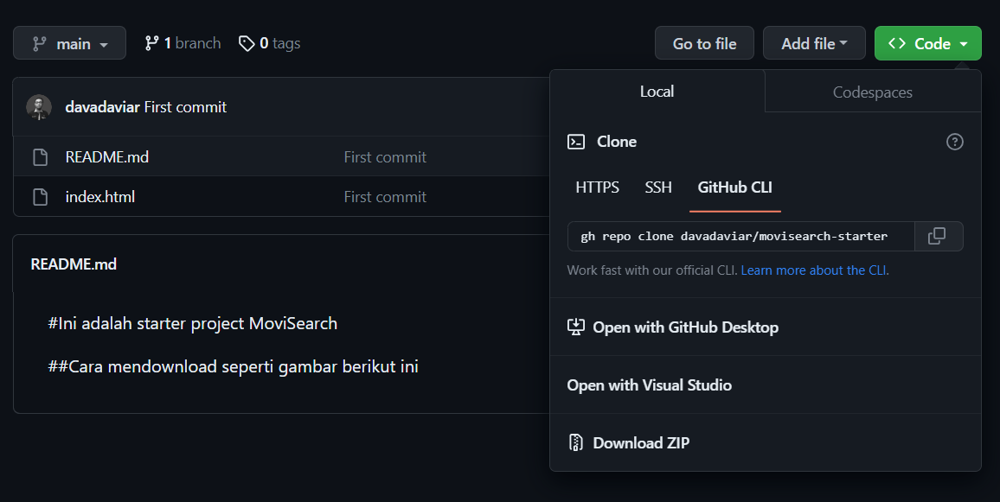

# Ini adalah starter project MoviSearch

## Cara mendownload seperti gambar berikut ini

Berikut cara dari mendownload source code, silahkan ikuti yang ada di gambar berikut. Setelah itu pilih **code** kemudian pilih **Download ZIP**. Setelah sudah silahkan ekstrak file tersebut dan buka folder tersebut pada Visual Studio Code anda atau aplikasi editor lain.

## Isi dari starter project 
Isi dari starter project tersebut adalah file **index.html**, folder **assets**, di dalam folder **assets** terdapat folder **css** dan **js**. Untuk isi lengkap dari folder tersebut silahkan anda ikuti langkah - langkah yang diajarkan pada modul **Codenesa**.
